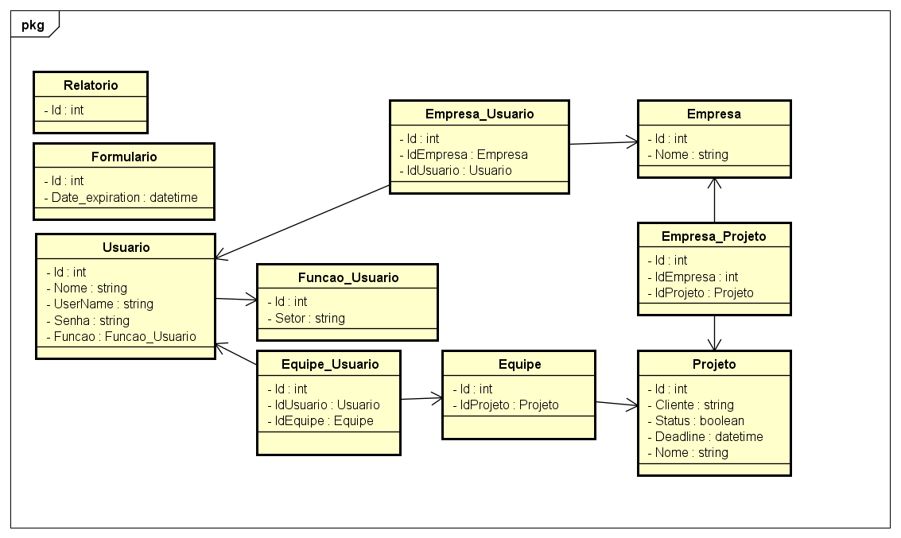

<h1>Configurações do projeto: </h1>

Antes de iniciar qualquer desenvolvimento do Backend, <a href="https://github.com/TeamWorkQualityReport/TeamWorkQualityReport/blob/master/README.md">configure</a> o seu sistema

Outra forma de configurar o seu ambiente é executando o seguinte comando: 

<code>pip install -r requirements.txt</code>

Pois o arquivo <b>requirements.txt</b> tem todos os dados e versões do sistema que você precisa instalar e configurar o seu sistema.

<h1>Buildando e Rodando a aplicação</h1>

Para rodar/buildar a aplicação, execute o comando abaixo: 

<code>python manage.py runserver</code>

<b>Usando o Docker</b>

Execute o comando da seção <b>Configuração do Docker</b> no final deste README onde ele executará a migração e o runserver

<h1>Testando via Shell do Python</h1>

Para testar e implementar dados no banco de dados, usamos o Shell do Python e para rodar ele, executamos o comando abaixo:

<code>python manage.py shell</code>

Após isso, realizamos os testes com cada model importando cada um deles e fazendo as queries desejadas. Vejam alguns exemplos abaixo:

Primeiro, importamos os modelos que queremos realizar a query.

<code>from twqsystem.models import Relatorio</code>

Depois podemos realizar as queries

<code>Relatorio.objects.all()
</code>

<code>Relatorio.objects.create('parametros')
</code>

<h1>Fazendo migrações no banco</h1>

Após as mudanças feitas no arquivo <b>twqsystem > models.py</b> realize o seguinte comando abaixo para iniciar a migração dos dados para o banco de dados: 

<code>python manage.py makemigrations</code>

Após isso, execute o comando para subir as migrações para o banco de dados: 

<code>python manage.py migrate</code>

Feito a migração! Você já pode testar usando o Shell as novas mudanças. Para subir para o docker faça o passo abaixo.

<b>Usando o Docker</b>

Execute o comando da seção <b>Configuração do Docker</b> no final deste README onde ele executará a migração e o runserver

<h1>Arquitetura do Sistema: </h1>

Os models foram definidos no arquivo: <b>twqsystem > models.py</b> e foram baseados nos modelos abaixo.

As configurações de <b>urls.py</b> do projeto estão em <b>teamworkquality > urls.py</b> e da aplicação dos sistemas estão configurados em <b>twqsystem > urls.py</b>

Os métodos criados estão no arquivo: <b>twqsystem > views.py</b> e nele há comentários de como cada método e chamada foi implementado.

Obs.: Alguns métodos foram implementados nos models (<b>twqsystem > models.py</b>) usando o decorator <i><b>@classmethod</i></b> para organizar o fluxo de chamada mas as mesmas podem ser realizadas na view

Todos os métodos retornam JSON via HttpRequest ou HttpResponse via uma chamada GET e via uma chamada POST retornam um status do HttpResponseRedirect

O plugin escolhido para exportação de arquivos em <b>PDF</b> é o <b>reportLab</b> que é baixando automaticamente quando realizamos a instalação do requirements.

Para utilização do serviço de email, usamos o próprio SMTP do Django e implementamos no arquivo: <b>twqsystem > views.py</b> pelo método <b>send_relatorio_email</b>

<h1>Configuração do DOCKER</h1>

Para facilitar o processo de desenvolvimento e garantir a consistência entre os ambientes.

Antes de qualquer coisa deve-se realizar o download do Docker Community Edition

https://www.docker.com

Uma vez realizado o download e instalação do docker basta executar o seguinte commando na raiz do projeto:

<code>docker-compose -f dev.docker-compose.yml up</code>

Para testar via Shell no docker, execute os comandos abaixo:

<code>docker exec -it teamworkqualityreport_server_1 bash</code>

<code>cd backend</code>

<code>python manage.py shell</code>

Obs.: Caso ao executar o comando acima tenha dado erro. Para continuar rodando a aplicação sem erros, vá em <b>teamworkquality > settings.py</b> e nas configurações de DATABASES em HOST coloque <b>localhost</b> e não db e execute o comando abaixo que vai estar tudo certo!

<code>python manage.py runserver</code>
